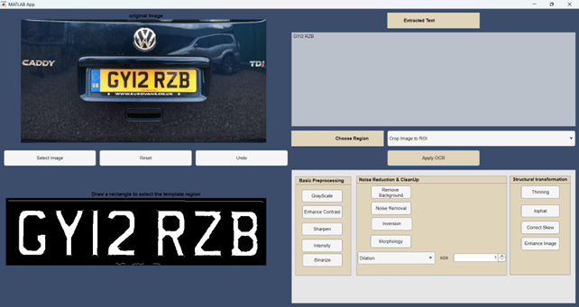

#  MATLAB OCR Image Recognition Tool

An interactive Optical Character Recognition (OCR) application built using MATLAB App Designer.  
This tool allows users to extract machine-readable text from images using advanced preprocessing techniques to improve OCR accuracy.

---

##  Application Preview

## Project Overview

The OCR Image Recognition Tool is designed to extract text from digital images such as:

- Scanned documents  
- Photographs  
- Screenshots  

The application integrates MATLAB’s built-in OCR engine with a rich set of image preprocessing techniques to enhance recognition performance.

It provides:

- Interactive region selection (ROI)
- Image enhancement and cleanup
- Skew correction
- Morphological transformations
- Real-time OCR output display

---

## 🏗 Architecture

The application maintains:
- Original Image state (`Img`)
- Modified Image state (`ModImg`)
- History stack for undo functionality
- ROI management logic
- Modular callback-based preprocessing pipeline
- Integrated OCR execution layer
  
---
## 🛠 Features

###  Image Input
- Supports JPG, PNG, BMP, and TIFF formats.
- Easy file selection via GUI.

---

### Basic Preprocessing
- Grayscale Conversion
- Contrast Enhancement (Adaptive Histogram Equalization)
- Sharpening
- Intensity Adjustment
- Binarization

---

###  Noise Reduction & Cleanup
- Median Filtering
- Background Removal (Bottom-hat transformation)
- Image Inversion
- Morphological Operations:
  - Erosion
  - Dilation
  - Opening
  - Closing

---

###  Structural Transformations
- Thinning
- Tophat Filtering
- Automatic Text Deskewing using Hough Transform Line Detection
- Image Upscaling for Improved OCR Performance

---

###  Region of Interest (ROI)
Users can:
- Process the entire image
- Crop image to selected ROI
- Apply preprocessing only to ROI

---

###  Editing Controls
- Undo last modification
- Reset to original image

---

## ⚙️ How It Works

1. Load an image.
2. Apply preprocessing techniques to enhance text clarity.
3. (Optional) Select a region of interest.
4. Click **Apply OCR**.
5. Extracted text appears in the output panel.

---

## 🧪 Technologies Used

- MATLAB App Designer
- MATLAB Image Processing Toolbox
- MATLAB OCR Engine
- Hough Transform for skew correction
- Morphological image processing operations

---

## 📈 Scope & Limitations

 Performs well on:
- Clear, printed text
- Standard document layouts

⚠ Limitations:
- Handwritten text recognition is limited
- Complex layouts may reduce accuracy
- Performance depends on image quality

Future improvements may include:
- Handwritten OCR support
- Multi-language recognition
- Deep learning-based preprocessing
- Document layout analysis

---

## ▶️ Running the Application

1. Open MATLAB.
2. Open the `.mlapp` file.
3. Click **Run**.
4. Start processing images.

---

## 📚 Additional Resources

### **User Manual**
The complete user manual (`user_manual.docx`) provides:
- **Full Tutorial**: Detailed walkthrough from image loading to text extraction
- **Visual Guides**: Screenshots of all interface components
- **Feature Details**: In-depth explanations of each preprocessing option

### **Manual Contents**:
1. **Introduction**: Tool overview and capabilities
2. **Getting Started**: Launching and interface tour
3. **Features & Functionality**: Detailed component explanations
4. **Conclusion**: Summary and future directions

*Refer to the manual for comprehensive guidance beyond this README.*
